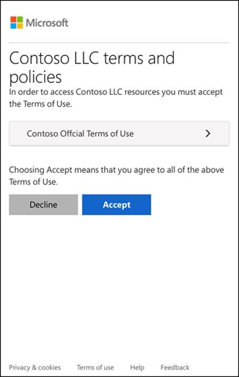

---
lab:
  title: 实验室 3：添加使用条款和接受报告
  module: 'Module : Deploying access using Microsoft Entra entitlement management'
---

# 实验室 3：添加使用条款和接受报告 

## 实验室方案

组织可以通过 Microsoft Entra 使用条款策略这种简单的方法向最终用户显示信息。 可以通过这样的呈现方式确保用户看到法律要求或符合性要求的相关免责声明。 本文介绍如何快速了解使用条款 (ToU) 策略。 你需要为组织创建并执行 ToU 策略。

#### 预计用时：20 分钟

### 练习 1 - 设置使用条款并对其进行测试

#### 任务 1 - 添加《使用条款》

 **重要提示** - 要使用和配置 Microsoft Entra ID 使用条款，必须具备：
 - Microsoft Entra ID Premium P1、P2、EMS E3 或 EMS E5 订阅。
 - 如果没有这些订阅，则可以获取 Microsoft Entra ID Premium 试用版。
 - 下述适用于需配置目录的管理员帐户之一：
  - 全局管理员角色
  - 安全管理员
  - 条件访问管理员

1. 使用全局管理员帐户登录到 [https://entra.microsoft.com](https://entra.microsoft.com)。

2. 打开左侧导航菜单，选择“ **标识治理**”。

3. 在菜单的“权利管理”**** 下，选择“使用条款”****。

4. 在“使用条款”页的顶部菜单中，选择“+ 新建条款”

    

5. 在“名称”框中，输入“测试使用条款”。

    **注意** - 这是将在 Azure 门户中使用的使用条款。

6. 选择“使用条款文档”框，浏览到已完成的使用条款 PDF，并将其选中。

   **ToU 文件已提供** - 浏览至 github 存储库 **AllFiles/Labs/Lab3**，获取在此实验室中使用的示例用户条款 PDF 文档。

7. 在“显示名称”框中，输入“Contoso 使用条款”。

    **注意** - 这是用户登录时看到的标题。

8. 对于《使用条款》文档的语言，选择“中文”。

   备注 - 可以通过语言选项上传多个版本的使用条款，每个版本的语言各不相同。 最终用户看到的使用条款版本取决于其浏览器首选项。

9. 如果要求最终用户在接受使用条款之前先查看条款，请将“要求用户展开使用条款”设置为“打开”。

10. 如果要求最终用户在每台访问设备上接受使用条款，请将“要求用户在每台设备上同意”设置为“关闭”。 如果启用此选项，用户可能需要安装其他应用程序。

    **警告** - 在每台设备上同意将要求用户在获得访问权限之前将每台设备注册到 Microsoft Entra ID。 建议将此设置设置为“打开”；但为了使实验室更简洁，我们将使用“关闭”。

11. 若要按计划使使用条款同意状态过期，请将“使同意状态过期”设置为“打开”。 设置为“打开”时，会显示另外两项计划设置。

12. 使用“过期开始日期”和“频率”设置来指定使用条款过期的计划。 下表显示了几项示例设置的结果：

    | 过期开始日期 | 频率 | 结果 |
    |---|---|---|
    | 今天的日期 | 每月 | 从今天开始，用户必须接受使用条款，并且以后每个月都要接受。|
    | 将来的日期 | 每月 | 从今天开始，用户必须接受使用条款。 到达指定的将来日期时，同意状态将会过期，以后用户必须每个月接受使用条款。 |

    例如，如果将过期开始日期设置为“**1 月 1 日**”，将频率设置为“**每月**”，则两个用户的过期计划如下：

    | User | 第一个接受日期 | 第一个过期日期 | 第二个过期日期 | 第三个过期日期 |
    |---|---|---|---|---|
    | Alice | 1 月 1 日 | 2 月 1 日 | 3 月 1 日 | 4 月 1 日|
    | Bob | 1 月 15 日 | 2 月 1 日 | 3 月 1 日| 4 月 1 日 |

13. 使用“需要重新接受使用条款之前的持续时间(天)”设置来指定用户必须重新接受使用条款之前所要经过的天数。 这可以让用户遵照自己的计划。 例如，如果将持续时间设置为 **30** 天，则两个用户的计划如下：

    | User | 第一个接受日期 | 第一个过期日期 | 第二个过期日期 | 第三个过期日期 |
    |---|---|---|---|---|
    | Alice | 1 月 1 日 | 1 月 31 日 | 3 月 2 日 | 4 月 1 日|
    | Bob | 1 月 15 日 | 2 月 14 日 | 3 月 16 日| 4 月 15 日

    备注 - 可以结合使用“使同意状态过期”和“需要重新接受使用条款之前的持续时间(天)”设置，但一般只使用其中的一项。

14. 在“条件访问”下，选择“自定义策略”。

    重要说明 - 条件访问策略控制（包括使用条款）不支持对服务帐户强制实施。 我们建议从条件访问策略中排除所有服务帐户。

    可以使用自定义条件访问策略将使用条款细化，向下细化到特定云应用程序或用户组。 有关详细信息，请参阅 [https://docs.microsoft.com/en-us/azure/active-directory/conditional-access/require-tou](https://docs.microsoft.com/en-us/azure/active-directory/conditional-access/require-tou)。

15. 完成后，选择“创建”。

16. 创建使用条款后，你将自动重定向到“条件访问策略”页。 在该页的“名称”框中，输入“强制执行 ToU”。

17. 在“**分配**”下，选择“**已选择 0 个用户和组**”。

18. 在“包括”选项卡上，选中“用户和组”复选框。

19. 在“选择”窗格中，选择“Adele Vance”以用于测试使用条款策略。

   警告 - 如果选择了管理员帐户，与所有条件访问策略一样，请确保另一个帐户具有足够的权限来更改条件访问策略。 这是为了确保如果条件访问策略导致不良结果，你的管理员帐户不会被锁定。

20. 在“**目标资源**”下，选择“**未选择目标资源**”。

21. 选择“所有云应用”。

22. 在“**访问控制**”和“**授权**”下，选择“**已选择 0 个控件**”。

23. 在“授权”窗格中，选择“测试使用条款”，然后选择“选择”。

24. 在“启用策略”下，选择“开” 。

25. 完成后，选择“创建”。

    

26. 如果选择使用自己的帐户，则可刷新浏览器。 系统将提示你重新登录。 当你登录时，你将需要接受使用条款。

#### 任务 2 - 以 Adele 身份登录

1. 打开一个新的 InPrivate 浏览器窗口。
2. 连接到 https://portal.azure.com。
3. 如果出现一条提示你已经登录的消息，请选择屏幕右上角的登录用户名，然后选择“使用其他帐户登录”。
4. 以 Adele 身份登录：

    | 设置 | 要输入的值 |
    | :--- | :--- |
    | 用户名 | AdeleV@ `<<your domain name>>.onmicrosoft.com` |
    | 密码 | 输入租户的管理员密码（请参阅“实验室资源”选项卡以检索租户管理员密码） |

5. 通过 MFA 请求验证 Adele 的登录情况。
6. 查看《使用条款》。
7. 可以选择“接受”或“拒绝” 。

    备注 - 如果选择了“拒绝”，那么在以后以 AdeleV 身份登录时，系统将再次要求你查看并接受《使用条款》 。

    **注意**：使用条款可能需要几分钟才会出现，或者你可以注销并重新登录门户。
 
#### 任务 3 - 查看关于已接受和已拒绝的用户的报告

“使用条款”页会显示已接受和拒绝的用户计数。 在使用条款有效期内，会存储这些计数以及接受用户/拒绝用户。

1. 在 Microsoft Azure 的“Identity Governance”>“使用条款”中，找到你的使用条款。

2. 对于某个使用条款，选择“已接受”或“已拒绝”下的数字，以查看用户的当前状态。

    

3. 在本练习中，你可能没有任何已接受或已拒绝的使用条款。 在下面的示例中，“已接受”值已选中。 你可查看报告的已接受使用条款的用户的用户信息。

    

4. 在“使用条款同意状态”页面上，选择“下载”下载同意状态报表 。

5. 在“标识治理 | 使用条款”页面，突出显示“测试使用条款”并选择“查看选定的审核日志”，以查看审核日志活动  。

#### 任务 4 - 呈现给用户的使用条款外观

1. 创建并强制执行使用条款后，处于使用条款范围内的用户会看到使用条款页。

    

2. 用户可以查看使用条款，如有必要，可使用按钮缩放。

    

3. 在移动设备上，使用条款的显示方式类似于以下示例。

    

#### 任务 5 - 用户如何查看其使用条款

用户可按以下过程查看已接受的使用条款。

1. 浏览到 [https://myapps.microsoft.com](https://myapps.microsoft.com/)，然后使用用户帐户登录。

2. 选择用户个人资料照片，然后选择“查看帐户”。 在“概述”页上，选择“查看设置和隐私”。

3. 在“设置和隐私”页上，选择“隐私”选项卡。

4. 在“组织的通知”下，你可查看你已接受的使用条款。

#### 任务 6 - 编辑使用条款详细信息

可以编辑使用条款的某些详细信息，但不能修改现有文档。 以下过程介绍如何编辑详细信息。

1. 以全局管理员身份登录  [https://entra.microsoft.com](https://entra.microsoft.com)  。

2. 打开 Microsoft Entra ID 项，从菜单中选择 **标识治理**。

3. 在左侧导航菜单的“权利管理”**** 下，选择“使用条款”****。

4. 选择要编辑的使用条款。

5. 在顶部菜单中，选择“编辑条款“。

6. 在“编辑使用条款”窗格中，可以更改以下各项：

 - **名称** - 这是不与最终用户共享的 ToU 的内部名称
 - **要求用户展开使用条款** - 如果将此项设置为“打开”，则会强制最终用户在接受使用条款文档之前先将其展开。
 - **更新现有使用条款**文档。
 - 可向现有 ToU 添加语言。要更改其他设置（例如，要求用户在每台设备上同意使用条款、使同意状态过期、重新接受使用条款之前的持续时间，或条件访问策略），必须创建新的使用条款。

    

7. 完成后，选择“保存”以保存所做的更改。

#### 任务 7 - 更新现有的使用条款文档

有时，你可能需要更新使用条款文档。

1. 选择要编辑的使用条款。

2. 选择“编辑条款”。

3. 在“语言选项”表中，确定要更新的使用条款语言，然后在“操作”列中选择“更新”。

    

4. 在“更新使用条款版本”窗格中，可上传新版本的使用条款文档。

5. 此外，如果希望要求用户在下次登录时接受这个新版本，则可使用“要求重新接受”切换按钮。 如果不要求用户重新接受，则他们先前的同意将保持最新，并且只有之前未同意或同意过期的新用户才会看到新版本。

    

6. 上传新 PDF 并决定要求重新接受后，选择“添加”。

7. 现在，你将看到最新版本位于“文档”列下。
