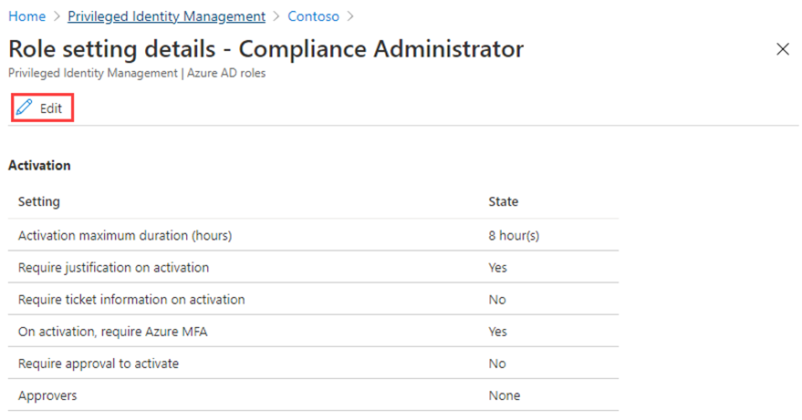

---
lab:
  title: 实验室 5：为 Microsoft Entra 角色配置 Privileged Identity Management
  module: 'Module : Deploying access using Microsoft Entra entitlement management'
---

# 实验室 5：为 Microsoft Entra 角色配置 Privileged Identity Management

## 实验室方案

特权角色管理员可以在其 Microsoft Entra 组织中自定义 Privileged Identity Management (PIM)，包括更改激活合格角色分配的用户的体验。 你需要熟悉如何配置 PIM。

#### 预计用时：30 分钟

### 练习 1 - 配置 Microsoft Entra 角色设置

#### 任务 1 - 打开角色设置

按照以下步骤打开 Microsoft Entra 角色的设置。

1. 以全局管理员身份登录  [https://entra.microsoft.com](https://entra.microsoft.com)  。

2. 搜索并选择“Privileged Identity Management”****。

3. 在“Privileged Identity Management”页的左侧导栏中，选择“Microsoft Entra 角色”****。

4. 在“快速启动”页的左侧导航窗格中，选择“设置”。

    

5. 查看角色列表，然后在“按角色名称搜索”中输入“合规性”。

6. 在结果中，选择“合规性管理员”。

7. 查看角色设置详细信息。

#### 任务 2 - 需要批准才能激活

1. 在“角色设置详细信息”页的顶部菜单中，选择“编辑”。

    

2. 在“编辑角色设置 - 合规性管理员”页上，选中“需要批准才能激活”复选框。

3. 选择“选择审批者”。

4. 在“选择成员”窗格中，选择你的管理员帐户，然后选择“选择”。

    

5. 配置角色设置后，选择“更新”以保存更改。

### 练习 2 - 具有 Microsoft Entra 角色的 PIM

#### 任务 1 - 分配角色

使用 Microsoft Entra ID，全局管理员可以创建永久 Microsoft Entra 管理员角色分配。 可以使用 Microsoft Entra 管理中心、Azure 门户或使用 PowerShell 命令创建这些角色分配。 Privileged Identity Management (PIM) 服务还允许特权角色管理员进行永久管理员角色分配。 此外，特权角色管理员可将用户设置为 Microsoft Entra 管理员角色的合格用户。 符合条件的管理员可在需要时激活角色，在完成任务后，其权限随即失效。

按照以下步骤操作以使用户符合 Microsoft Entra 管理员角色的条件。

1. 使用全局管理员帐户登录到 [https://entra.microsoft.com](https://entra.microsoft.com)。

2. 搜索并选择“Privileged Identity Management”****。

    **备注** - 可以在“标识”-“标识治理”-“Privileged Identity Management”菜单中查找它。

3. 在“Privileged Identity Management”页的左侧导栏中，选择“Microsoft Entra 角色”****。

4. 在“快速启动”页的左侧导航窗格中，选择“角色”。

5. 在顶部菜单中，选择“+ 添加分配”。

    

6. 在“添加分配”页的“成员身份”选项卡上，查看设置。

7. 选择“选择角色”菜单，然后选择“合规性管理员”。

8. 可以使用“按名称搜索角色”筛选器来帮助查找角色。

9. 在“选择成员”下，选择“未选择任何成员”。

10. 在“选择成员”窗格中，选择“Miriam Graham”，然后选择“选择” 。

11. 在“添加分配”页上，选择“**下一步 >**”。

12. 在“设置”选项卡的“分配类型”下，查看可用选项。 对于此任务，请使用默认设置，“**合格**”。

    - “合格”  分配要求该角色的成员执行某个操作才能使用该角色。 操作可能包括执行多重身份验证 (MFA) 检查、提供业务理由或请求获得指定审批者的批准。
    - “活动”分配不要求该角色的成员执行任何操作便可使用该角色。 分配为“活动”的成员拥有始终分配给该角色的特权。

13. 查看其余设置，然后选择“分配”。

#### 任务 2 - 以 Miriam 身份登录

1. 打开一个新的 InPrivate 浏览器窗口。
2. 连接到 Microsoft Entra 管理中心 (https://entra.microsoft.com)。
    **备注** - 如果打开时用户已登录，请在右上角选择其名称，然后选择“以其他帐户登录”****。
3. 以 Miriam 身份登录。

   | 字段 | 值 |
   | :--- | :--- |
   | 用户名 | MiriamG@ `<<your domain.onmicrosoft.com>>` |
   | 密码 |  输入租户的管理员密码（请参阅“实验室资源”选项卡以检索租户管理员密码） |

**备注** - 出现提示时，请更改密码。

5. 在“标识”**** 菜单中，打开“用户”****，然后选择“所有用户”****。
6. 在用户列表中查找“Miriam”****
7. 在“概述”**** 页上，查找“已分配的角色”****。
8. 选择“符合条件的分配”****。
1. 请注意，Miriam 现在可以使用“合规性管理员”角色。

#### 任务 3 - 激活 Microsoft Entra 角色

需要担任某个 Microsoft Entra 角色时，可以通过在 Privileged Identity Management 中打开“我的角色”**** 来请求激活。

1. 从“搜索资源、服务和文档”栏中，查找“特权”。
2. 打开“Privileged Identity Management”**** 页。
3. 在“Privileged Identity Management”页上，在左侧导航菜单中选择“我的角色”。

4. 在“我的角色”页中，查看“符合条件的分配”**** 列表。

    

5. 在“合规性管理员角色”行中，选择“激活”。

6. 在“激活 - 合规性管理员”窗格中，选择“需要其他验证”，然后按照说明提供其他安全验证。 在每个会话中只需执行身份验证一次。

    

    验证 - 根据当前实验室环境配置，需要配置 MFA 并成功登录。

7. 完成附加安全验证后，在“激活 - 合规性管理员”窗格的“原因”框中，输入“这是我激活此角色的理由” 。

    重要说明 - 最小权限原则，帐户激活的时长应该为所需的时长。  如果需要完成的工作只需要 1.5 小时，那么将持续时间设置为 2 小时。  同样，如果你知道自己在下午 3 点前无法完成工作，请选择“自定义”激活时间。

8. 选择“激活”  。

#### 任务 4 - 分配范围受限的角色

对于某些角色，所授予权限的范围可以限制为单个管理单元、服务主体或应用程序。 若要分配范围为一个管理单元的角色，则可参考此过程。

1. 请记得关闭 MiriamG 的浏览器窗口，然后使用管理员帐户打开 Microsoft Entra 管理中心。
2. 浏览到“Privileged Identity Management”页，然后在左侧导航菜单中选择 Azure“Microsoft Entra 角色”****。
3. 选择“角色”。
4. 在“角色”页的顶部菜单上，选择“+ 添加分配”。

5. 在“添加分配”页上，选择“选择角色”菜单，然后选择“用户管理员” 。

6. 选择“范围类型”菜单，并查看可用选项。 现在，你需要使用“目录”范围类型。

   提示 - 转到 [https://docs.microsoft.com/en-us/azure/active-directory/roles/admin-units-manage](https://docs.microsoft.com/en-us/azure/active-directory/roles/admin-units-manage)，详细了解管理单元范围类型。

7. 与在不具有限制的范围内分配角色一样，你需要添加成员并完成设置选项。 现在选择“取消”。

#### 任务 5 - 更新或删除现有的角色分配

按照以下步骤更新或删除现有的角色分配。

1. 在“打开 Privileged Identity Management”>“Microsoft Entra 角色”页的左侧导航栏中，选择“分配”****。

2. 在“分配”列表中，对于合规性管理员，查看“操作”列中的选项。

3. 选择“更新”并查看“成员身份设置”窗格中的可用选项。 完成后，关闭窗格。

4. 选择“删除” 。

5. 在“删除”对话框中，查看信息，然后选择“是”。
